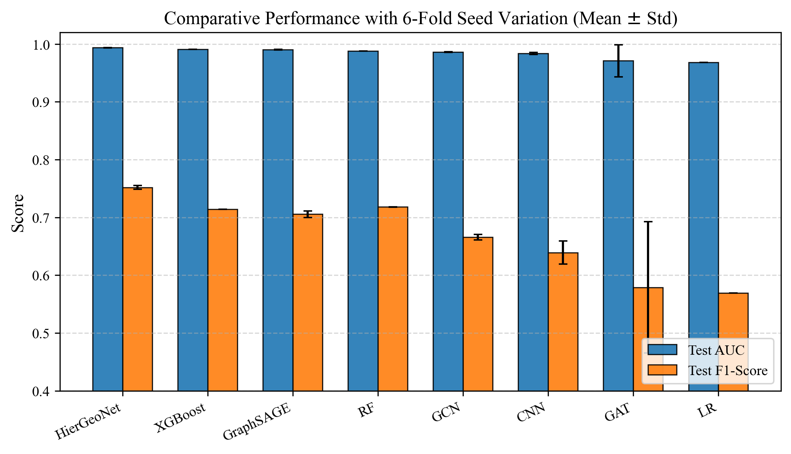
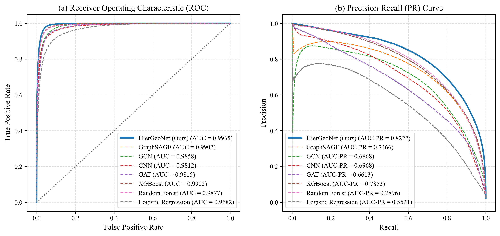
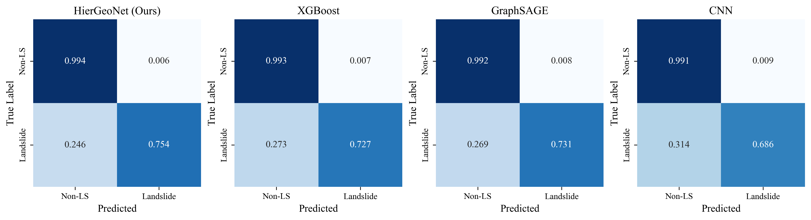
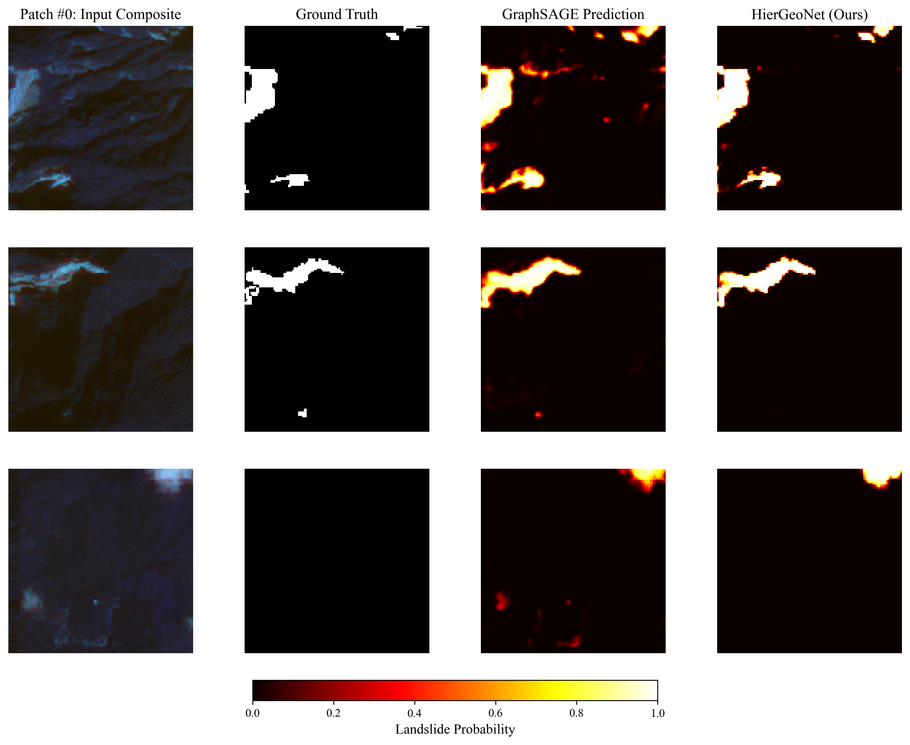

# HierGeoNet: Hierarchical Geo-Graph Attention Network for Landslide Susceptibility Mapping

This repository contains the training pipeline, evaluation code, and result artifacts for **HierGeoNet**, a multi-scale graph attention network for pixel-level landslide susceptibility prediction from Sentinel-2 imagery. It is published as the results-reference companion to the associated research paper.

> **Paper:** _add citation / DOI / arXiv link here once available_
> **Contact:** _add author contact here_

---

## 1. What this repository is (and isn't)

This repo provides:
- The current model, training, and multi-seed evaluation pipeline (`train.py`) used to produce the paper's reported numbers.
- A standalone ablation study script (`ablation_study.py`) that isolates the contribution of each architectural component.
- The exact result artifacts referenced in the paper — metrics files, benchmark tables, and figures — under [`results/`](results/), copied verbatim from the runs that produced them.
- The previous, superseded version of the pipeline, preserved for provenance in [`legacy/`](legacy/) (see [§2.3](#23-versioning-note-legacy-vs-current-pipeline) for why this matters).

This repo does **not** include:
- The raw Sentinel-2 / landslide inventory dataset (see [§4](#4-data) for why, and where to get it).
- Trained model checkpoints (not included by default; see [§6](#6-reproducing-results) if you want to regenerate them).
- Code that generates `results/figures/*.png`. The current pipeline (`train.py`) computes and saves metrics as JSON/CSV only; figure generation for this version of the results was done separately and is not included in this repository. See [§2.3](#23-versioning-note-legacy-vs-current-pipeline).

If you're here from the paper and just want the numbers and figures, jump to [§5](#5-results).

---

## 2. Method summary

### 2.1 Architecture

HierGeoNet represents each 128×128 image patch as **three coupled graphs at different spatial scales**:

| Scale | Node count | Node spacing | Purpose |
|---|---|---|---|
| Fine | 16,384 | every pixel | local, pixel-precise terrain/spectral detail |
| Medium | 1,849 | every 3rd pixel | intermediate context |
| Coarse | 225 | every 9th pixel | broad spatial/geographic context |

Each scale is processed by a stack of Graph Attention (GAT) layers. The coarse graph additionally receives a **geographic positional encoding** (sinusoidal, based on patch-relative lat/lon coordinates) and is passed through a **Transformer encoder** to model long-range spatial dependence. Information is then propagated back down through **learned cross-scale bridges** (gated residual connections) from coarse → medium → fine and coarse → fine directly, and fused into a final per-pixel prediction.

Training combines three objectives:
- **Weighted BCE** (`pos_weight` to counter severe class imbalance — landslide pixels are a small minority of the data)
- **Dice loss** (segmentation-style overlap term)
- **Geographic contrastive loss** — pulls together embeddings of same-class pixels that are spatially close, and pushes apart embeddings of different-class or spatially distant pixels, using a sampled-pair margin loss

Full architectural and hyperparameter details are in [`train.py`](train.py) (see the `Config` class and the `HierGeoNet` model definition).

### 2.2 Evaluation protocol: multi-seed

The current pipeline evaluates every model — HierGeoNet and all baselines — across **6 random seeds** (`Config.SEEDS = [42, 43, 44, 45, 46, 47]`), reporting mean ± standard deviation for each metric. Each model/seed combination is trained and evaluated independently, with per-seed results cached to disk (`models/*_test_metrics.json`) so a long multi-seed sweep can be interrupted and resumed, or run one seed/model at a time, without recomputation. This replaces the single-seed evaluation used in the previous version of this pipeline (see below).

### 2.3 Versioning note: legacy vs. current pipeline

This repository has gone through a pipeline revision, and both versions are preserved here deliberately rather than the old one being deleted, because published paper claims may reference either version's artifacts:

| | **Current** (`train.py`) | **Legacy** (`legacy/run_hiergeonet.py`) |
|---|---|---|
| Evaluation | 6 seeds, mean ± std | Single seed (42) |
| Invocation | CLI (`--model`, `--seed`, `--aggregate_only`) | Runs everything, no arguments |
| Baselines compared | GCN, GraphSAGE, GAT, CNN, LR, RF, XGBoost (7) | GCN, GraphSAGE, GAT (single-layer), SGCN-LSTM, CNN, LR, RF, XGBoost (8, includes SGCN-LSTM) |
| Ablation study | Not included (see `ablation_study.py`, extracted from legacy) | Included (STAGE 4 of the script) |
| Figure generation | Not included in this script | Included (`matplotlib`/`seaborn` calls throughout) |
| Metrics computed | AUC, F1, IoU, Recall, Precision, MCC, Accuracy | AUC, F1, Recall, Precision, MCC, AP (average precision) |
| Results in this repo | `results/metrics/benchmark_comparison_multiseed.csv`, `results/figures/fig{1,2,3,4}_*.png` | `results/metrics/{test_metrics.json, benchmark_comparison.csv}`, `results/figures/{benchmark_chart, roc_confusion, training_curves, sample_predictions}.png` |

The **ablation study results are unchanged between versions** — `results/metrics/ablation_study.csv` was produced by the legacy pipeline's ablation logic (STAGE 4) and has not been re-run against the current pipeline. `ablation_study.py` in the repository root is that same logic extracted into a standalone script (see its module docstring for full provenance details); it subclasses `HierGeoNet` from the *current* `train.py`, since the base architecture is identical between versions, but has not itself been re-executed since extraction. If you modify `HierGeoNet`'s architecture going forward, re-run `ablation_study.py` before citing the CSV against your changes.

**A note on figures specifically:** the current pipeline (`train.py`) contains no plotting code at all — it writes JSON and CSV only. The four figures under `results/figures/` (`fig1`–`fig4`) that accompany the current multi-seed results were therefore generated by separate code not included in this repository. If you need to regenerate or modify these figures, you will need to write plotting code against the JSON/CSV outputs `train.py` produces; the legacy script's plotting sections (`legacy/run_hiergeonet.py`) are a reasonable starting reference for style/format, though they plot single-seed rather than multi-seed data.

---

## 3. Repository structure

```
hiergeonet-landslide-susceptibility/
├── train.py                         # CURRENT pipeline: CLI tool for multi-seed
│                                    #   training/evaluation of HierGeoNet + 7 baselines.
│                                    #   No ablation code, no figure generation.
├── ablation_study.py                # Standalone ablation study (6 configs), extracted
│                                    #   from legacy/run_hiergeonet.py. See its docstring.
│                                    #   Imports Config/HierGeoNet/etc. from train.py above
│                                    #   (both scripts live at the repo root together, so
│                                    #   this is a plain same-directory import).
├── legacy/
│   └── run_hiergeonet.py            # SUPERSEDED single-seed pipeline. Kept for provenance:
│                                    #   contains the original ablation logic and all
│                                    #   figure-generation code. See §2.3.
├── results/
│   ├── metrics/
│   │   ├── benchmark_comparison_multiseed.csv  # CURRENT: HierGeoNet vs. 7 baselines,
│   │   │                                       #   6-seed mean±std (test set)
│   │   ├── ablation_study.csv                  # Component ablation (unchanged; see §2.3)
│   │   ├── test_metrics.json                   # LEGACY: single-seed test metrics
│   │   ├── benchmark_comparison.csv            # LEGACY: single-seed benchmark table
│   │   └── README.md                           # Data dictionary for all metrics files
│   └── figures/
│       ├── fig1_benchmark_metrics.png          # CURRENT: 6-seed mean±std bar chart
│       ├── fig2_roc_pr_curves.png              # CURRENT: ROC + Precision-Recall curves
│       ├── fig3_confusion_matrices.png         # CURRENT: normalized confusion matrices
│       ├── fig4_qualitative_landslide_maps.png # CURRENT: qualitative prediction maps
│       ├── benchmark_chart.png                 # LEGACY: single-seed bar chart
│       ├── roc_confusion.png                   # LEGACY: ROC curves + confusion matrix
│       ├── training_curves.png                 # LEGACY: loss/AUC/F1/LR over training
│       └── sample_predictions.png              # LEGACY: qualitative prediction maps
├── requirements.txt
├── LICENSE
└── README.md
```

---

## 4. Data

The pipeline expects Sentinel-2-derived patches and binary landslide masks in HDF5 format, laid out as:

```
<project_root>/
├── images/
│   ├── train/       *.h5   (each contains dataset "img", shape [14, 128, 128])
│   ├── validation/  *.h5
│   └── test/        *.h5
└── annotations/
    ├── train/        *.h5  (each contains dataset "mask", shape [128, 128], binary)
    ├── validation/   *.h5
    └── test/         *.h5
```

- **14 input channels per patch** (Sentinel-2 spectral bands and/or derived terrain features — see `Config.IN_DIM` in `train.py`; exact band assignment should match the paper's Data/Methods section).
- Mask files are matched to image files by filename, replacing `"image"` with `"mask"` in the filename.

This repository does not redistribute the dataset. **Add the specific source/citation for your Sentinel-2 imagery and landslide inventory here** (e.g. the originating catalog, region, and date range), so results are independently reproducible.

---

## 5. Results

All numbers below are copied directly from the files in [`results/`](results/), which are the unmodified outputs of the pipeline versions described in [§2.3](#23-versioning-note-legacy-vs-current-pipeline). The current, headline results are the 6-seed multi-seed numbers in this section; the previous single-seed results remain available in `results/metrics/` and `results/figures/` for anyone cross-referencing an earlier version of the paper, and are described in [§5.5](#55-previous-single-seed-results-legacy).

### 5.1 Multi-seed benchmark comparison (current, n=6 seeds per model)

HierGeoNet is compared against classical ML (Logistic Regression, Random Forest, XGBoost), a flat CNN, and three graph baselines (GCN, GraphSAGE, GAT). Every model, including HierGeoNet, is trained and evaluated independently at each of 6 seeds (42–47), each evaluated on the held-out test set at its own F1-optimal threshold (selected per-seed via a precision-recall sweep). Reported values are mean ± standard deviation across the 6 seeds.

| Model | AUC-ROC | F1 | Precision | Recall | MCC | IoU | Accuracy |
|---|---|---|---|---|---|---|---|
| **HierGeoNet (ours)** | **0.9936 ± 0.0002** | **0.7519 ± 0.0032** | 0.7455 ± 0.0032 | 0.7584 ± 0.0051 | **0.7461 ± 0.0032** | **0.6024 ± 0.0041** | **0.9886 ± 0.0001** |
| XGBoost | 0.9906 ± 0.0000 | 0.7138 ± 0.0000 | 0.6994 ± 0.0000 | 0.7289 ± 0.0000 | 0.7072 ± 0.0000 | 0.5550 ± 0.0000 | 0.9867 ± 0.0000 |
| GraphSAGE | 0.9901 ± 0.0006 | 0.7056 ± 0.0057 | 0.6875 ± 0.0066 | 0.7247 ± 0.0050 | 0.6988 ± 0.0058 | 0.5452 ± 0.0068 | 0.9862 ± 0.0003 |
| Random Forest | 0.9876 ± 0.0001 | 0.7182 ± 0.0003 | 0.7049 ± 0.0038 | 0.7321 ± 0.0038 | 0.7116 ± 0.0003 | 0.5603 ± 0.0004 | 0.9869 ± 0.0001 |
| GCN | 0.9860 ± 0.0003 | 0.6656 ± 0.0048 | 0.6379 ± 0.0111 | 0.6959 ± 0.0033 | 0.6581 ± 0.0047 | 0.4988 ± 0.0054 | 0.9841 ± 0.0004 |
| CNN | 0.9835 ± 0.0017 | 0.6392 ± 0.0201 | 0.6113 ± 0.0282 | 0.6701 ± 0.0114 | 0.6311 ± 0.0202 | 0.4700 ± 0.0217 | 0.9827 ± 0.0013 |
| GAT | 0.9709 ± 0.0275 | 0.5788 ± 0.1136 | 0.5635 ± 0.0809 | 0.5994 ± 0.1421 | 0.5704 ± 0.1141 | 0.4152 ± 0.0991 | 0.9807 ± 0.0033 |
| Logistic Regression | 0.9683 ± 0.0000 | 0.5692 ± 0.0000 | 0.5343 ± 0.0000 | 0.6091 ± 0.0000 | 0.5598 ± 0.0000 | 0.3979 ± 0.0000 | 0.9790 ± 0.0000 |

Source: [`results/metrics/benchmark_comparison_multiseed.csv`](results/metrics/benchmark_comparison_multiseed.csv). Full precision is preserved in that file; the table above is rounded to 4 places. Sorted by mean AUC-ROC, matching the CSV's own sort order.

HierGeoNet attains the highest mean AUC-ROC, F1, MCC, IoU, and Accuracy of all eight models, **and does so with one of the smallest standard deviations** (AUC std of 0.0002, second only to XGBoost/LR/RF's near-zero std) — meaning its advantage is consistent across random seeds, not driven by a single favorable run. **GAT is a clear outlier for stability**: its F1 standard deviation (0.1136) is roughly 6–36× larger than HierGeoNet, GraphSAGE, GCN, and CNN's (the other models with a clearly nonzero F1 std), and its AUC standard deviation (0.0275) is over an order of magnitude larger than any other model's. This is visible directly in the error bars of Figure 1 below. Any claim comparing HierGeoNet to GAT specifically should account for this — GAT's mean F1 (0.5788) is the lowest of all eight models, but its best individual seed likely performs considerably better than that mean suggests, and its worst seed considerably worse.



### 5.2 ROC and Precision-Recall curves



HierGeoNet achieves the highest AUC-ROC (0.9935) and, more distinctively, the highest **AUC-PR / average precision (0.8222)** of all eight models — a substantially larger margin over the next-best model (Random Forest, AUC-PR 0.7896; XGBoost, 0.7853) than the AUC-ROC comparison alone suggests. AUC-PR is generally the more informative metric under severe class imbalance, since it does not credit a classifier for correctly identifying the (easy, abundant) majority class. **Note:** AUC-PR is not present in `benchmark_comparison_multiseed.csv` — the per-seed metrics computed by `train.py` do not include average precision (see [§2.3](#23-versioning-note-legacy-vs-current-pipeline)'s metrics comparison), so the 0.8222 figure above should be read as a single-run value illustrated in this figure, not a 6-seed mean.

### 5.3 Confusion matrices



Row-normalized confusion matrices (values sum to 1.0 per row) for HierGeoNet and three representative baselines. HierGeoNet correctly identifies 75.4% of landslide pixels (recall) while maintaining a 99.4% true-negative rate. These values are consistent with, but not identical to, the 6-seed mean recall of 0.7584 in §5.1 (within roughly one standard deviation) — this figure shows a single representative run's confusion matrix rather than an average of six confusion matrices.

### 5.4 Qualitative predictions



Three representative test patches, each showing the Sentinel-2 input composite, binary ground truth, and continuous landslide-probability maps for GraphSAGE and HierGeoNet. HierGeoNet's probability maps show visibly tighter spatial agreement with the ground-truth mask boundaries than GraphSAGE's, which tends to predict wider, less spatially precise high-probability regions (most apparent in the bottom row, where GraphSAGE assigns elevated probability to a bright unrelated feature in the input composite that HierGeoNet does not).

### 5.5 Previous single-seed results (legacy)

The pipeline's previous version (`legacy/run_hiergeonet.py`) evaluated HierGeoNet on a held-out test set (n=800 patches, 13,107,200 pixels) at a single seed, and compared against 8 baselines (including SGCN-LSTM, not present in the current comparison) on a 245-patch validation set. These results are preserved in `results/metrics/test_metrics.json`, `results/metrics/benchmark_comparison.csv`, and `results/figures/{benchmark_chart, roc_confusion, training_curves, sample_predictions}.png`.

| Metric | Value |
|---|---|
| AUC-ROC | 0.9934 |
| F1 (positive class) | 0.7487 |
| Precision | 0.7476 |
| Recall | 0.7498 |
| MCC | 0.7428 |
| Average Precision (AP) | 0.8158 |
| Operating threshold | 0.6992 |

Source: [`results/metrics/test_metrics.json`](results/metrics/test_metrics.json). Full data dictionary and additional legacy tables (including the 8-model single-seed benchmark comparison) are in [`results/metrics/README.md`](results/metrics/README.md).

### 5.6 Ablation study (unchanged from legacy; see §2.3)

Each row removes or modifies one architectural component from the full model, retrained from scratch and evaluated on the validation set at a fixed 0.5 threshold. The "w/o medium graph" configuration was independently retrained across **3 random seeds** to check whether its result was a stable effect or a single-run anomaly.

| Configuration | AUC-ROC | F1 | Precision | Recall | ΔAUC | ΔF1 |
|---|---|---|---|---|---|---|
| **HierGeoNet (full)** | 0.9940 | 0.7583 | 0.6992 | 0.8283 | — | — |
| w/o cross-scale bridges | 0.9939 | 0.7423 | 0.6512 | 0.8631 | −0.0001 | −0.0160 |
| w/o coarse Transformer | 0.9945 | 0.7394 | 0.6280 | 0.8987 | +0.0006 | −0.0189 |
| w/o medium graph (Seed 42) | 0.9937 | 0.7483 | 0.6678 | 0.8508 | −0.0003 | −0.0101 |
| w/o medium graph (Seed 43) | 0.9936 | 0.7170 | 0.6015 | 0.8874 | −0.0004 | −0.0413 |
| w/o medium graph (Seed 44) | 0.9937 | 0.7398 | 0.6392 | 0.8781 | −0.0003 | −0.0185 |

Source: [`results/metrics/ablation_study.csv`](results/metrics/ablation_study.csv), produced by [`ablation_study.py`](ablation_study.py) (extracted from `legacy/run_hiergeonet.py`; see that script's docstring for full provenance).

Two things worth calling out, since they affect how strongly the ablation should be read:

1. **AUC-ROC is essentially insensitive to every ablation tested** (all deltas within ±0.0006 of the full model), while **F1 is consistently more sensitive** — every ablated configuration loses 1.6–4.1 F1 points. AUC alone would not distinguish these configurations; F1 (or precision/recall individually) is the more informative metric for this ablation.
2. **The "w/o medium graph" F1 drop is not stable across seeds**: it ranges from −0.0101 (seed 42) to −0.0413 (seed 43), a 4× spread. Any claim in the paper about the *specific magnitude* of the medium-graph contribution should cite this full range rather than a single seed's number. All three ablated configurations do consistently underperform the full model on F1, so the *direction* of the effect is well-supported; the *size* of the effect is noisier.

---

## 6. Reproducing results

### Environment

```bash
python -m venv venv
source venv/bin/activate  # Windows: venv\Scripts\activate
pip install -r requirements.txt
```

A CUDA-capable GPU is strongly recommended — the script auto-detects CUDA and falls back to CPU otherwise. Mixed-precision (bfloat16 autocast) is enabled automatically when a GPU is available.

### Running the current pipeline (multi-seed)

`train.py` is a CLI tool:

```bash
# Train and evaluate every model (HierGeoNet + 7 baselines) across all 6 seeds
python train.py --model all

# Train/evaluate just HierGeoNet, across all 6 seeds
python train.py --model HierGeoNet

# Train/evaluate just one model at one specific seed
python train.py --model GraphSAGE --seed 44

# Skip training entirely; aggregate whatever per-seed JSON results already
# exist on disk into results/metrics/benchmark_comparison_multiseed.csv
python train.py --aggregate_only
```

`--model` accepts: `HierGeoNet`, `GCN`, `GraphSAGE`, `GAT`, `CNN`, `LR`, `RF`, `XGBoost`, `Flat` (all three classical baselines), or `all` (default).

Each model/seed combination checkpoints independently under `models/`, with a "done marker" JSON (`models/*_test_metrics.json`) written on completion — rerunning the same `--model`/`--seed` combination will skip straight to loading the cached result rather than retraining. Delete the relevant marker file to force a retrain.

**This script does not generate figures.** See [§2.3](#23-versioning-note-legacy-vs-current-pipeline).

### Running the ablation study

```bash
python ablation_study.py
```

Runs all 6 ablation configurations (see [§5.6](#56-ablation-study-unchanged-from-legacy-see-23)) and writes `outputs/ablation_study.csv`. This script has its own checkpointing under `models/ablation_*` and does not depend on `train.py` having been run first — it builds its own graph topology and dataloaders independently (though it does import the `HierGeoNet` base class and `Config` from `train.py`; see the script's docstring).

### Running the legacy pipeline

```bash
python legacy/run_hiergeonet.py
```

Runs the full previous single-seed pipeline end-to-end: training, all 8 baselines, the ablation study, and all four legacy figures. Provided for reference/reproducibility of the previous version's results only — new work should use `train.py` and `ablation_study.py` instead.

### Key hyperparameters

Identical between the current and legacy pipelines; defined in the `Config` class in `train.py` (and mirrored in `legacy/run_hiergeonet.py`):

| Parameter | Value |
|---|---|
| Input channels | 14 |
| Embedding dims (fine / medium / coarse) | 128 / 192 / 256 |
| GAT heads / layers | 4 / 2 |
| Transformer heads / layers | 8 / 3 |
| Dropout | 0.15 |
| Batch size | 32 |
| Learning rate | 5e-4 (AdamW, warmup 15 epochs + cosine decay) |
| Weight decay | 1e-4 |
| Positive class weight | 3.5 |
| Contrastive loss weight (λ) | 0.1 |
| Max epochs / early-stop patience | 100 / 20 |
| Seeds (current pipeline only) | 42, 43, 44, 45, 46, 47 |

---

## 7. Citation

If you use this code or reference these results, please cite the paper:

```bibtex
@article{hiergeonet,
  title   = {ADD PAPER TITLE},
  author  = {ADD AUTHOR LIST},
  journal = {ADD VENUE},
  year    = {ADD YEAR},
  note    = {Code and results: https://github.com/<your-username>/hiergeonet-landslide-susceptibility}
}
```

_(Replace the placeholders above once the paper's final title, author list, venue, and year are set — and update the BibTeX key/URL to match.)_

## 8. License

Released under the [MIT License](LICENSE).
